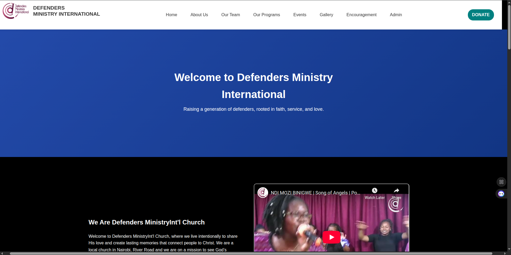
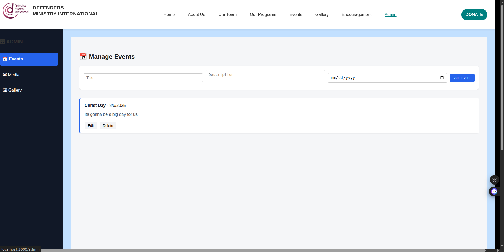

**🎬 DMI Church Encouragement Media App**
**📖 Overview**
This project is a full-stack application developed for DMI Church to help uplift and encourage church members through categorized media content — including videos and audios.

It is designed to allow users to:

Browse by emotional/spiritual categories (e.g., Joy, Peace, Faith)

Watch or listen to encouraging content

Upload videos and audios through an admin interface

## Project Structure

```
my-node-react-app
├── backend
│   ├── src
│   │   └── index.js          # Entry point for the Node.js backend application
│   ├── package.json          # Backend dependencies and scripts
│   └── README.md             # Documentation for the backend
├── frontend
│   ├── src
│   │   ├── App.js            # Main React component
│   │   └── index.js          # Entry point for the React application
│   ├── public
│   │   └── index.html        # Main HTML file for the React application
│   ├── package.json          # Frontend dependencies and scripts
│   └── README.md             # Documentation for the frontend
└── README.md                 # Overall documentation for the project
```


**🚀 Features**
✅ Upload audio/video media with category and caption

✅ Dynamically fetch and filter media by category

✅ Stream videos and audios directly in the browser

✅ Clean and mobile-friendly UI

✅ Automatically handles media preview and rendering

📸 Screenshots
🔹 Home Page

🔹 Upload Form
Admin interface to upload new encouragement videos or audios

🔹 Video Player
Media playback experience


## Getting Started

### Prerequisites

- Node.js and npm installed on your machine.

### Backend Setup

1. Navigate to the backend directory:
   ```
   cd backend
   ```

2. Install dependencies:
   ```
   npm install
   ```

3. Start the backend server:
   ```
   npm start
   ```

### Frontend Setup

1. Navigate to the frontend directory:
   ```
   cd frontend
   ```

2. Install dependencies:
   ```
   npm install
   ```

3. Start the frontend application:
   ```
   npm start
   ```

### 🙏 Acknowledgments
This project was built to serve the DMI Church community, with the aim of providing encouragement, hope, and inspiration through media.
## Usage

- Access the backend API at `http://localhost:5000` (or the port specified in your backend configuration).
- Access the frontend application at `http://localhost:3000` (or the port specified in your frontend configuration).

## Contributing

Feel free to submit issues or pull requests for improvements or bug fixes. 

## License

This project is licensed under the MIT License.